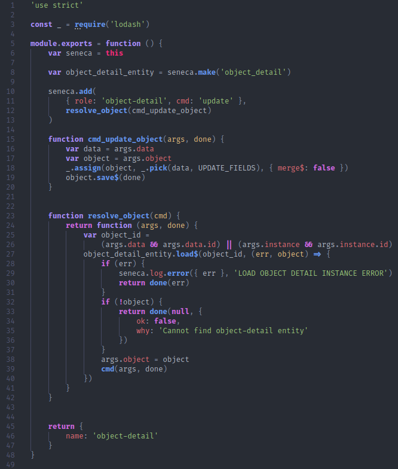

# Crud node.js
projeto realizado para o teste 'One Blue'. Este repostitório contêm o código fonte do teste e a resposta para a pergunta.

## Descrição do projeto
Desenvolvimento de um API, utilizando a arquitetura REST/RESTful capaz de realizar um CRUD (CREATE, READ, UPDATE, DELETE) de 'posts' desenvolvido com Node.js, o framework Express, e utilizando MongoDB para persistência dos dados.

## Como utilizar
- Clonar o repositório
- Executar o comando  `npm i`  para instalar as dependecias
- Fazer uma cópia do arquivo `.env.example` e chamar de `.env`
- Atualizar variáveis de ambiente no arquivo `.env`
- Executar o comando `npm start` para rodar o servidor
- Utilize o `Postman`, `Insomnia`, ou similares para realizar as requisições

### Tecnologias e recursos utilizados
- Node.js
- Express
- MongoDB (mongoose)
- Javascript

### Resposta da pergunta

`USE_STRICT` => declarando a utilzação do modo restrito do Javascript, impossibilitando algumas más
praticas com o uso do Javascript, além de todas as funcionalidades do ES3 estarão por padrão desabilitada.

`CONST _ = REQUIRE('LODASH')` => Foi utilizada a biblioteca 'lodash' do javascript, para ajudar a lidar com manipulação do método 'assign' na função 'cmd_update_object'.

###### module.exports = function()

`VAR SENECA = THIS` => declarando a instância do 'seneca' no espoco da função

` VAR OBJECT_DETAIL_ENTITY` => seneca.make('object_detail') => Criando entidade de objetos que corresponderá a coleção 'object_detail_entity ' e atribuindo a variável 'object_detail_entity '.

Adicionando na coleção 'object_detail' a ação update, o retorno da função 'resolve_object' que por sua vez recebe a copia de um objeto da função 'cmd_update_object'.

`FUNCTION CMD_UPDATE_OBJECT` => recebe um objeto, realiza a cópia dele com o método 'assign', e retorna com o método 'pick' a filtragem deste objeto através da chave 'UPDATE_FIELDS', obtendo a lista de updates dos dados do objeto. Salvando o objeto atualizado.

`FUNCTION RESOLVE_OBJECT` => recebe o objeto salvo pela função 'cmd_update_object' verifica pelo id que está nos dados gerado pelo objeto em questão é o mesmo, ou pelo id da própria instância do objeto, através do'object_detail_entity' que neste momento é a coleção de entidades 'object_detail' carregemento do objeto com o método 'load', que carrega um objeto (com seu id) que esta na coleção e uma função arrow, que será executada caso seja gerado um erro na verificação do id, se o mesmo nao corresponder ao id do objeto, ou caso seja diferente de um objeto. Emitindo uma resposta de error e encerrando a comunicação, caso seja retornado algum dos erros. Caso passe pela verificação, será atribuido a propriedade 'cmd' o objetos com seus os valores atualizados.

##### O Código está exportando uma função que recebe e realizar o tratamento de um objeto, recebido através de um microserviço, neste caso foi utiliziado o 'seneca' para realizar as tratativas de atualizar um objeto na coleção
